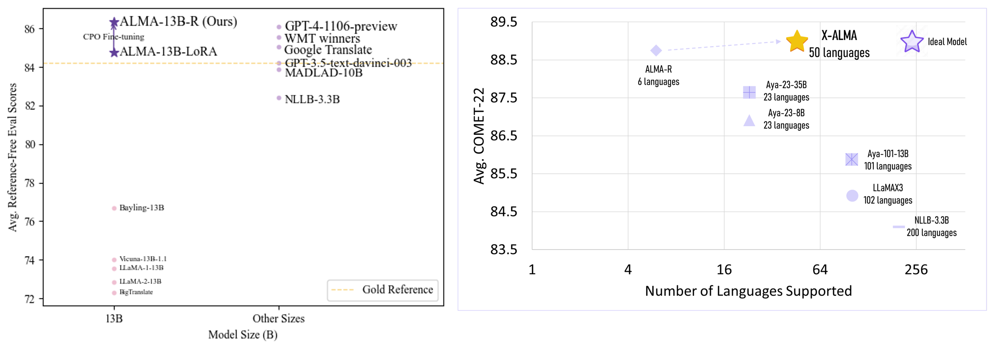

<p align="center">
    
</p>

<div align="center">
    
# ALMA: Advanced Language Model-based translator
</div>

<p align="center">
<a href="LICENSE" alt="MIT License"></a>
<a href="https://arxiv.org/abs/2309.11674" alt="ALMA paper"></a>
<a href="https://arxiv.org/abs/2401.08417" alt="ALMA-R paper"></a>
<a href="https://arxiv.org/pdf/2410.03115" alt="X-ALMA paper"></a>
<!-- <a href="https://notes.aimodels.fyi/alma-a-new-training-method-that-boosts-translation-performance-for-large-language-models/"></a> -->
<a href="https://www.clsp.jhu.edu/" alt="jhu"></a>
<a href="https://www.microsoft.com/en-us/research/" alt="MSlogo"></a>
<a href="https://twitter.com/fe1ixxu">
  </a>
</p>

ALMA has three generations: ALMA (1st), ALMA-R (2nd), and **X-ALMA(3rd NEW!)**.

[**ALMA**](https://arxiv.org/abs/2309.11674) (**A**dvanced **L**anguage **M**odel-based Tr**A**nslator) is a many-to-many LLM-based translation model,  which adopts a new translation model paradigm: it begins with fine-tuning on monolingual data and is further optimized using high-quality parallel data. This two-step fine-tuning process ensures strong translation performance.

**[ALMA-R](https://arxiv.org/pdf/2401.08417v2.pdf)** builds upon ALMA models, with further LoRA fine-tuning with our proposed **Contrastive Preference Optimization (CPO)** as opposed to the Supervised Fine-tuning used in ALMA. CPO fine-tuning requires our [triplet preference data](https://huggingface.co/datasets/haoranxu/ALMA-R-Preference) for preference learning. ALMA-R now can matches or even exceeds GPT-4 or WMT winners!

**[X-ALMA](https://arxiv.org/pdf/2410.03115) (NEW!) extends ALMA(-R) from 6 languages to 50 languages and ensures top-tier performance across 50 diverse languages, regardless of their resource levels. This is achieved by plug-and-play language-specific module architecture and a carefully designed 5-step training recipe with novel *Adaptive-Rejection Preference Optimization* methods.** 

*Old ALMA Repo:*
- The original **ALMA** repository can be found [here](https://github.com/fe1ixxu/ALMA/tree/a3cc7877752779346312bb07798172eadc83d692).
- The original **ALMA-R** repository can be found [here](https://github.com/fe1ixxu/ALMA/tree/ac120eb44c609ad9a386d617172d40432c2c0df6).

# News 🌟
⭐ Oct. 6 2024 **X-ALMA** is out! Please find the [paper here](https://arxiv.org/pdf/2410.03115) and [models & datasets here](https://huggingface.co/collections/haoranxu/x-alma-66fde464ef90be465920abaa).

⭐ Jun. 20 2024 We want to give a shout out to [SimPO](https://arxiv.org/pdf/2405.14734), which shares a similar reference-free preference learning framework with CPO but in a more stable manner due to its special length normalization and target reward margin. The most exciting thing is that CPO and SimPO can potentially be used together! Learn more about [CPO-SimPO](https://github.com/fe1ixxu/CPO_SIMPO)!

⭐ May.1 CPO paper has been accepted at **ICML 2024**!

⭐ Mar.22 2024 CPO method now is merged at [huggingface trl](https://github.com/huggingface/trl)! See details [here](https://github.com/huggingface/trl/pull/1382).

⭐ Jan.16 2024 **ALMA-R** is released! Please check more details with our new paper: [Contrastive Preference Optimization: Pushing the Boundaries of LLM Performance in Machine Translation](https://arxiv.org/abs/2401.08417).

⭐ Jan.16 2024 The ALMA paper: [A Paradigm Shift in Machine Translation: Boosting Translation Performance of Large Language Models](https://arxiv.org/abs/2309.11674) has been accepted at **ICLR 2024**! Check out more details [here](https://openreview.net/forum?id=farT6XXntP)!

# Contents 📄
- [Download ALMA Models and Dataset](#download-alma-models-and-dataset-)
- [A Quick Start](#a-quick-start)
- [Environment Setup](#environment-setup-)
- [Evaluation](#evaluation-)
- [Training](#training-)
- [FAQs](#faqs-)

:star: Supports :star:
  - AMD and Nvidia Cards
  - Data Parallel Evaluation
  - Also support LLaMA-1, LLaMA-2, OPT, Faclon, BLOOM, MPT
  - LoRA Fine-tuning
  - Monolingual data fine-tuning, parallel data fine-tuning

<p align="center">

</p>

# Download ALMA Models and Dataset 🚀

We release seven translation models for ALMA series:

Model checkpoints are released at huggingface:
|     Models    | Base Model Link | LoRA Link |
|:-------------:|:---------------:|:---------:|
|    ALMA-7B (1st gen)    |        [haoranxu/ALMA-7B](https://huggingface.co/haoranxu/ALMA-7B)        |     -     |
|  ALMA-7B-LoRA (1st gen) |        [haoranxu/ALMA-7B-Pretrain](https://huggingface.co/haoranxu/ALMA-7B-Pretrain)        |     [haoranxu/ALMA-7B-Pretrain-LoRA](https://huggingface.co/haoranxu/ALMA-7B-Pretrain-LoRA)     |
|  ALMA-7B-R (2nd gen) |        [haoranxu/ALMA-7B-R (LoRA merged)](https://huggingface.co/haoranxu/ALMA-7B-R)        |     -    |
|    ALMA-13B-LoRA (1st gen)   |        [haoranxu/ALMA-13B](https://huggingface.co/haoranxu/ALMA-13B)        |     -     |
| ALMA-13B-LoRA |        [haoranxu/ALMA-13B-Pretrain](https://huggingface.co/haoranxu/ALMA-13B-Pretrain)        |     [haoranxu/ALMA-13B-Pretrain-LoRA](https://huggingface.co/haoranxu/ALMA-13B-Pretrain-LoRA)     |
| ALMA-13B-R (2nd gen) |        [haoranxu/ALMA-13B-R (LoRA merged)](https://huggingface.co/haoranxu/ALMA-13B-R)        |    -   |
|  **X-ALMA (NEW, 3rd gen)** |        [X-ALMA Models](https://huggingface.co/collections/haoranxu/x-alma-66fde464ef90be465920abaa)        |    -   |

**Note that `ALMA-7B-Pretrain` and `ALMA-13B-Pretrain` are NOT translation models. They only experience stage 1 monolingual fine-tuning (20B tokens for the 7B model and 12B tokens for the 13B model), and should be utilized in conjunction with their LoRA models.** 

*We have also provided the WMT'22 and WMT'23 translation outputs from ALMA-13B-LoRA and ALMA-13B-R in the `outputs` directory. These outputs also includes our outputs of baselines and can be directly accessed and used for subsequent evaluations.*

Datasets used by ALMA and ALMA-R are also released at huggingface now (NEW!)
|     Datasets    | Train / Validation| Test |
|:-------------:|:---------------:|:---------:|
|   ALMA Human-Written Parallel Data    |        [Parallel train and validation](https://huggingface.co/datasets/haoranxu/ALMA-Human-Parallel)        |     [WMT'22](https://huggingface.co/datasets/haoranxu/WMT22-Test)    |
|  ALMA-R Triplet Preference Data |        [Triplet Preference Data](https://huggingface.co/datasets/haoranxu/ALMA-R-Preference)        |   [WMT'22](https://huggingface.co/datasets/haoranxu/WMT22-Test) and [WMT'23](https://huggingface.co/datasets/haoranxu/WMT23-Test)   |
|  **X-ALMA Data** |   50-language   [parallel data](https://huggingface.co/datasets/haoranxu/X-ALMA-Parallel-Data) and [preference data](https://huggingface.co/datasets/haoranxu/X-ALMA-Preference)        |   [WMT'23](https://huggingface.co/datasets/haoranxu/WMT23-Test) and [FLORES-200](https://huggingface.co/datasets/haoranxu/X-ALMA-Parallel-Data)  |


# A Quick Start
X-ALMA is designed with a plug-and-play architecture, consisting of two components: a base model and language-specific modules, with each module shared across different language groups.
There are three ways to load X-ALMA for translation. An example of translating "我爱机器翻译。" into English (X-ALMA should also able to do multilingual open-ended QA). 

**The first way**: loading the merged model where the language-specific module has been merged into the base model (Recommended):
```
import torch
from transformers import AutoModelForCausalLM
from transformers import AutoTokenizer
from peft import PeftModel

GROUP2LANG = {
    1: ["da", "nl", "de", "is", "no", "sv", "af"],
    2: ["ca", "ro", "gl", "it", "pt", "es"],
    3: ["bg", "mk", "sr", "uk", "ru"],
    4: ["id", "ms", "th", "vi", "mg", "fr"],
    5: ["hu", "el", "cs", "pl", "lt", "lv"],
    6: ["ka", "zh", "ja", "ko", "fi", "et"],
    7: ["gu", "hi", "mr", "ne", "ur"],
    8: ["az", "kk", "ky", "tr", "uz", "ar", "he", "fa"],
}
LANG2GROUP = {lang: str(group) for group, langs in GROUP2LANG.items() for lang in langs}
group_id = LANG2GROUP["zh"]

model = AutoModelForCausalLM.from_pretrained(f"haoranxu/X-ALMA-13B-Group{group_id}", torch_dtype=torch.float16, device_map="auto")
tokenizer = AutoTokenizer.from_pretrained(f"haoranxu/X-ALMA-13B-Group{group_id}", padding_side='left')

# Add the source sentence into the prompt template
prompt="Translate this from Chinese to English:\nChinese: 我爱机器翻译。\nEnglish:"

# X-ALMA needs chat template but ALMA and ALMA-R don't need it.
chat_style_prompt = [{"role": "user", "content": prompt}]
prompt = tokenizer.apply_chat_template(chat_style_prompt, tokenize=False, add_generation_prompt=True)

input_ids = tokenizer(prompt, return_tensors="pt", padding=True, max_length=40, truncation=True).input_ids.cuda()

# Translation
with torch.no_grad():
    generated_ids = model.generate(input_ids=input_ids, num_beams=5, max_new_tokens=20, do_sample=True, temperature=0.6, top_p=0.9)
outputs = tokenizer.batch_decode(generated_ids, skip_special_tokens=True)
print(outputs)
```

**The second way**: loading the base model and language-specific module (Recommended):
```
model = AutoModelForCausalLM.from_pretrained("haoranxu/X-ALMA-13B-Pretrain", torch_dtype=torch.float16, device_map="auto")
model = PeftModel.from_pretrained(model, f"haoranxu/X-ALMA-13B-Group{group_id}")
tokenizer = AutoTokenizer.from_pretrained(f"haoranxu/X-ALMA-13B-Group{group_id}", padding_side='left')
```

**The third way**: loading the base model with all language-specific modules like MoE: (Require large GPU memory)
```
from modeling_xalma import XALMAForCausalLM
model = XALMAForCausalLM.from_pretrained("haoranxu/X-ALMA", torch_dtype=torch.float16, device_map="auto")
tokenizer = AutoTokenizer.from_pretrained("haoranxu/X-ALMA", padding_side='left')

# Add `lang="zh"`: specify the language to instruct the model on which group to use for the third loading method during generation.
generated_ids = model.generate(input_ids=input_ids, num_beams=5, max_new_tokens=20, do_sample=True, temperature=0.6, top_p=0.9, lang="zh")
```


The ALMA and ALMA-R translation prompt is:
```
Translate this from <source language name> into <target language name>:
<source language name>: <source language sentence>
<target language name>:
```

The X-ALMA translation prompt is:
```
<s>[INST] Translate this from <source language name> into <target language name>:
<source language name>: <source language sentence>
<target language name>: [/INST]
```

# Environment Setup 🔧
```
conda create -n xalma python=3.11
conda activate xalma
```
If you use **AMD GPUs**, please first install torch with ROCm.

Then install other dependencies:
```
bash install_alma.sh
```
# Evaluation 💻
### Evaluation on X-ALMA
This is a quick start to evaluate our X-ALMA model. To produce translation outputs for FLORES-200 in both en→cs and cs→en directions, (If you want to evaluate WMT'23 instead, simply pass `--override_test_data_path haoranxu/WMT23-Test`.), run the following command. **Note that You don't need enable `--chat_style` for ALMA and ALMA-R. This is only for X-ALMA**

```
accelerate launch --config_file configs/deepspeed_eval_config_bf16.yaml \
    run_llmmt.py \
    --model_name_or_path haoranxu/X-ALMA-13B-Group5 \
    --do_predict \
    --low_cpu_mem_usage \
    --language_pairs en-cs,cs-en \
    --mmt_data_path placeholder \
    --override_test_data_path haoranxu/FLORES-200 \
    --per_device_eval_batch_size 1 \
    --output_dir ./your_output_dir/ \
    --predict_with_generate \
    --max_new_tokens 256 \
    --max_source_length 256 \
    --bf16 \
    --seed 42 \
    --num_beams 5 \
    --overwrite_cache \
    --overwrite_output_dir \
    --chat_style # `--chat_style` only for X-ALMA. You don't need enable `--chat_style` for ALMA and ALMA-R

```
The generated outputs will be saved in the `your_output_dir`. The translation file for the `en→cs` direction is named `test-en-cs`, and the file for the cs→en direction is `test-cs-en`.
The variable `${test_pairs}` denotes the translation directions you wish to evaluate. It supports testing multiple directions at once. For example, you can use `de-en,en-de,en-cs,cs-en`.

Please see more other examples for evaluating ALMA(-R) under the `./evals` folder:

**Note that this will perform data-parallel evaluation supported by deepspeed: that is, placing a single full copy of your model onto each available GPU and splitting batches across GPUs to evaluate on K GPUs K times faster than on one**. For those with limited GPU memory, we offer an alternative method. The user can pass `--multi_gpu_one_model` to run the process by distributing a single model across multiple GPUs. Please see evaluation examples in `evals/alma_13b_r.sh` or  `evals/*no_parallel` files.

# Training 🔥
Here we show how to 
- contrastive Preference Optmization Upon ALMA Models (ALMA→ALMA-R).
- fine-tune LLaMA-2-7B on monolingual OSCAR data (stage 1)
- fine-tune human-written parallel data fine-tuning once stage 1 is completed, including full-weight and LoRA fine-tuning (stage 2)

Please note that we do not share the training process for X-ALMA specifically, as it would require releasing numerous intermediate checkpoints, making the process overly complex.

## **CPO Fine-Tuning**
To run the CPO fine-tuning with our triplet preference data, run the following command:
```
bash runs/cpo_ft.sh ${your_output_dir}
```
### OSCAR Monolingual Fine-Tuning
To execute the OSCAR monolingual fine-tuning, use the following command:
```
bash runs/mono_ft.sh ${your_output_dir}
```
### Parallel Data Fine-Tuning (Full-Weight)
Once the monolingual data fine-tuning is complete, proceed to the parallel data fine-tuning using the full-weight approach. Execute the following command:
```
bash runs/parallel_ft.sh ${your_output_dir} $training_pairs$
```
where `training_pairs` is the translation directions you considered. The default is all 10 directions: `de-en,cs-en,is-en,zh-en,ru-en,en-de,en-cs,en-is,en-zh,en-ru`.

### Parallel Data Fine-Tuning (LoRA)
In Stage 2, there's also an option to employ LoRA for fine-tuning on the parallel data. To do so, execute the following command:
```
bash runs/parallel_ft_lora.sh ${your_output_dir} $training_pairs$
```

# FAQs ❓
### What language directions do ALMA and ALMA-R support?
Currently, ALMA supports 10 directions: English↔German, Englishs↔Czech, Englishs↔Icelandic, Englishs↔Chinese, Englishs↔Russian. However, it may surprise us in other directions :)

### What language directions do X-ALMA support?
X-ALMA supports 50 languages and 98 directions (into and from English): da,nl,de,is,no,sv,af,ca,ro,gl,it,pt,es,bg,mk,sr,uk,ru,id,ms,th,vi,mg,fr,hu,el,cs,pl,lt,lv,ka,zh,ja,ko,fi,et,gu,hi,mr,ne,ur,az,kk,ky,tr,uz,ar,he,fa

### When should I stop fine-tuning at stage 1?
Our 7B and 13B models are trained on 20B and 12B tokens, respectively. However, as indicated in the paper, fine-tuning 1B tokens should boost the performance substantially. The steps required to fine-tune 1 billion tokens also vary based on your batch size. In our case, the batch size is calculated as follows: 16 GPUs * 4 (batch size per GPU) * 4 (gradient accumulation steps) = 256. With a sequence length of 512, we need approximately 8,000 steps to train on 1 billion tokens, calculated as 10^9 / (256*512) ≈8000 steps. However, you may choose to fine-tune more steps to get better performance.

### How to decide the interleave probability at stage 1?
Please find the reasons for interleave probability selection for stage 1 in Appendix D.1 in the [paper](https://arxiv.org/pdf/2309.11674.pdf)!

# Reference
Please find more details for ALMA models in our [paper](https://arxiv.org/abs/2309.11674) or the [summary](https://notes.aimodels.fyi/alma-a-new-training-method-that-boosts-translation-performance-for-large-language-models/) of the paper.
```
@inproceedings{
    xu2024a,
    title={A Paradigm Shift in Machine Translation: Boosting Translation Performance of Large Language Models},
    author={Haoran Xu and Young Jin Kim and Amr Sharaf and Hany Hassan Awadalla},
    booktitle={The Twelfth International Conference on Learning Representations},
    year={2024},
    url={https://openreview.net/forum?id=farT6XXntP}
}
```

Please also find more detailed information for the ALMA-R model with Contrastive Preference Optimization in the [paper](https://arxiv.org/pdf/2401.08417v2.pdf).
```
@inproceedings{
    xu2024contrastive,
    title={Contrastive Preference Optimization: Pushing the Boundaries of {LLM} Performance in Machine Translation},
    author={Haoran Xu and Amr Sharaf and Yunmo Chen and Weiting Tan and Lingfeng Shen and Benjamin Van Durme and Kenton Murray and Young Jin Kim},
    booktitle={Forty-first International Conference on Machine Learning},
    year={2024},
    url={https://openreview.net/forum?id=51iwkioZpn}
}
```

Please find details about X-ALMA in the latest [paper](https://arxiv.org/pdf/2410.03115)
```
@misc{xu2024xalmaplugplay,
      title={X-ALMA: Plug & Play Modules and Adaptive Rejection for Quality Translation at Scale}, 
      author={Haoran Xu and Kenton Murray and Philipp Koehn and Hieu Hoang and Akiko Eriguchi and Huda Khayrallah},
      year={2024},
      eprint={2410.03115},
      archivePrefix={arXiv},
      primaryClass={cs.CL},
      url={https://arxiv.org/abs/2410.03115}, 
}
```
