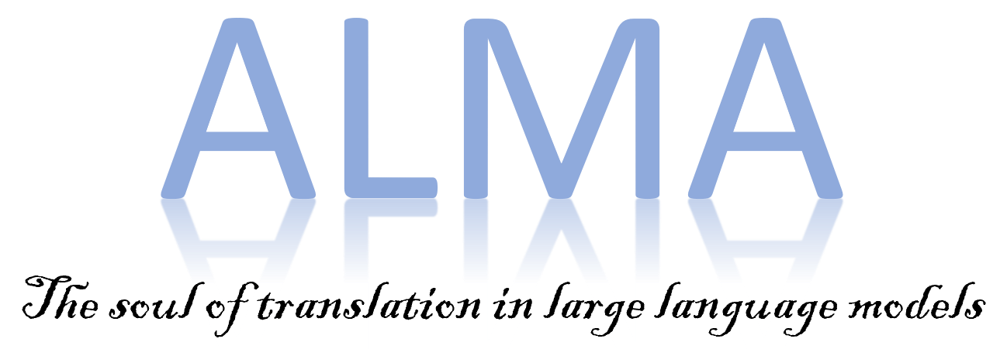
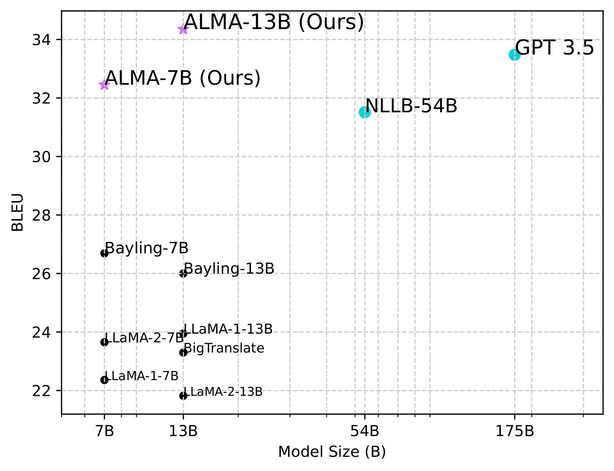

<p align="center">
    
</p>

<div align="center">
    
# ALMA: Advanced Language Model-based translator
</div>

<p align="center">
<a href="LICENSE" alt="MIT License"></a>
<a href="https://arxiv.org/abs/2309.11674" alt="Paper Link"></a>
<a href="https://notes.aimodels.fyi/alma-a-new-training-method-that-boosts-translation-performance-for-large-language-models/"></a>
<a href="https://www.clsp.jhu.edu/" alt="jhu"></a>
<a href="https://www.microsoft.com/en-us/research/" alt="MSlogo"></a>
<a href="https://twitter.com/fe1ixxu">
  </a>
</p>

**ALMA** (**A**dvanced **L**anguage **M**odel-based tr**A**nslator) is a many-to-many LLM-based translation model, which adopts a new translation model paradigm: it begins with fine-tuning on monolingual data and is further optimized using high-quality parallel data. This two-step fine-tuning process ensures strong translation performance. 

Please find more details in our [paper](https://arxiv.org/abs/2309.11674) or the [summary](https://notes.aimodels.fyi/alma-a-new-training-method-that-boosts-translation-performance-for-large-language-models/) of the paper.
```
@misc{xu2023paradigm,
      title={A Paradigm Shift in Machine Translation: Boosting Translation Performance of Large Language Models}, 
      author={Haoran Xu and Young Jin Kim and Amr Sharaf and Hany Hassan Awadalla},
      year={2023},
      eprint={2309.11674},
      archivePrefix={arXiv},
      primaryClass={cs.CL}
}
```

# Contents 📄
- [Download ALMA Models](#download-alma-models-)
- [Environment Setup](#environment-setup-)
- [Evaluation](#evaluation-)
- [Training](#training-)
- [Data Information](#data-information-)
- [FAQs](#faqs-)

:star: Supports :star:
  - AMD and Nvidia Cards
  - Data Parallel Evaluation
  - Also support LLaMA-1, LLaMA-2, OPT, Faclon, BLOOM, MPT
  - LoRA Fine-tuning
  - Monolingual data fine-tuning, parallel data fine-tuning

<p align="center">

</p>

# Download ALMA Models 🚀

We release four translation models presented in the paper:
- **ALMA-7B**: Full-weight Fine-tune LLaMA-2-7B on 20B monolingual tokens and then **Full-weight** fine-tune on human-written parallel data
- **ALMA-7B-LoRA**: Full-weight Fine-tune LLaMA-2-7B on 20B monolingual tokens and then **LoRA** fine-tune on human-written parallel data
- **ALMA-13B**: Full-weight Fine-tune LLaMA-2-13B on 12B monolingual tokens and then **Full-weight** fine-tune on human-written parallel data
- **ALMA-13B-LoRA** (Our best system): Full-weight Fine-tune LLaMA-2-13B on 12B monolingual tokens and then **LoRA** fine-tune on human-written parallel data
  
We have also provided the translation outputs from our best system, ALMA-13B-LoRA, in the `outputs/ours/` directory. These outputs can be directly accessed and used for subsequent evaluations.

Model checkpoints are released at huggingface:
|     Models    | Base Model Link | LoRA Link |
|:-------------:|:---------------:|:---------:|
|    ALMA-7B    |        [haoranxu/ALMA-7B](https://huggingface.co/haoranxu/ALMA-7B)        |     -     |
|  ALMA-7B-LoRA |        [haoranxu/ALMA-7B-Pretrain](https://huggingface.co/haoranxu/ALMA-7B-Pretrain)        |     [haoranxu/ALMA-7B-Pretrain-LoRA](https://huggingface.co/haoranxu/ALMA-7B-Pretrain-LoRA)     |
|    ALMA-13B   |        [haoranxu/ALMA-13B](https://huggingface.co/haoranxu/ALMA-13B)        |     -     |
| ALMA-13B-LoRA |        [haoranxu/ALMA-13B-Pretrain](https://huggingface.co/haoranxu/ALMA-13B-Pretrain)        |     [haoranxu/ALMA-13B-Pretrain-LoRA](https://huggingface.co/haoranxu/ALMA-13B-Pretrain-LoRA)     |

**Note that `ALMA-7B-Pretrain` and `ALMA-13B-Pretrain` are NOT translation models. They only experience stage 1 monolingual fine-tuning (20B tokens for the 7B model and 12B tokens for the 13B model), and should be utilized in conjunction with their LoRA models.** 

A quick start to use our best system (ALMA-13B-LoRA) for translation. An example of translating "我爱机器翻译。" into English:
```
import torch
from peft import PeftModel
from transformers import AutoModelForCausalLM
from transformers import LlamaTokenizer

# Load base model and LoRA weights
model = AutoModelForCausalLM.from_pretrained("haoranxu/ALMA-13B-Pretrain", torch_dtype=torch.float16, device_map="auto")
model = PeftModel.from_pretrained(model, "haoranxu/ALMA-13B-Pretrain-LoRA")
tokenizer = LlamaTokenizer.from_pretrained("haoranxu/ALMA-13B-Pretrain", padding_side='left')

# Add the source sentence into the prompt template
prompt="Translate this from Chinese to English:\nChinese: 我爱机器翻译。\nEnglish:"
input_ids = tokenizer(prompt, return_tensors="pt", padding=True, max_length=40, truncation=True).input_ids.cuda()

# Translation
with torch.no_grad():
    generated_ids = model.generate(input_ids=input_ids, num_beams=5, max_new_tokens=20, do_sample=True, temperature=0.6, top_p=0.9)
outputs = tokenizer.batch_decode(generated_ids, skip_special_tokens=True)
print(outputs)
```

The general translation prompt is:
```
Translate this from <source language name> into <target language name>:
<source language name>: <source language sentence>
<target language name>:
```

# Environment Setup 🔧
Execute the given command, and it will set up two virtual environments: `alma` and `comet`. Use `alma` for both model training and test generation, while `comet` is specifically designed for evaluation purposes (BLEU and COMET).
```
conda create -n alma python=3.8
conda activate alma
```
If you use **Nvidia GPUs**, install torch with cuda 11.8
```
pip3 install torch torchvision torchaudio --index-url https://download.pytorch.org/whl/cu118
```
If you use **AMD GPUs**, install torch with ROCm 5.4.2
```
pip3 install torch torchvision torchaudio --index-url https://download.pytorch.org/whl/rocm5.4.2
```
Then install other dependencies:
```
bash install_alma.sh
```
and install env `comet`:
```
conda create -n comet python=3.8
conda activate comet
pip install unbabel-comet
pip install sacrebleu[ja]
```

# Evaluation 💻
### Evaluation on ALMA-7B 
This is a quick start to evaluate our ALMA-7B model. To produce translation outputs for WMT'22 in both en→cs and cs→en directions, simply run the following command:
```
accelerate launch --config_file configs/deepspeed_eval_config.yaml \
    run_llmmt.py \
    --model_name_or_path haoranxu/ALMA-7B \
    --do_predict \
    --low_cpu_mem_usage \
    --language_pairs en-cs,cs-en \
    --mmt_data_path ./human_written_data/ \
    --per_device_eval_batch_size 2 \
    --output_dir ./your_output_dir \
    --predict_with_generate \
    --max_new_tokens 256 \
    --max_source_length 256 \
    --fp16 \
    --seed 42 \
    --num_beams 5 \
    --overwrite_cache \
    --overwrite_output_dir
```
The generated outputs will be saved in the `your_output_dir`. The translation file for the `en→cs` direction is named `test-en-cs`, and the file for the cs→en direction is `test-cs-en`.
We have prepared a bash file for the user to easily run the evaluation:
```
bash evals/alma_7b.sh ${your_output_dir} ${test_pairs}
```
The variable `${test_pairs}` denotes the translation directions you wish to evaluate. It supports testing multiple directions at once. For example, you can use `de-en,en-de,en-cs,cs-en`. Once the bash script completes its execution, both the BLEU scores and COMET results will be automatically displayed.

**Note that this will perform data-parallel evaluation supported by deepspeed: that is, placing a single full copy of your model onto each available GPU and splitting batches across GPUs to evaluate on K GPUs K times faster than on one**. For those with limited GPU memory, we offer an alternative method. This allows you to run the process by distributing a single model across multiple GPUs:
```
bash evals/alma_7b_no_parallel.sh ${your_output_dir} ${test_pairs}
```

### Evaluation on ALMA-7B-LoRA
To evaluate the translation performance of ALMA-7B-LoRA, one needs to pass `--use_peft` and `--peft_model_id` to enable LoRA. One can find details by running:
```
bash evals/alma_7b_lora.sh ${your_output_dir} ${test_pairs}
```
Similarly, you can run the model in a model-parallel (but not data parallel) way by running:
```
bash evals/alma_7b_lora_no_parallel.sh ${your_output_dir} ${test_pairs}
```

### Evaluation on ALMA-13B and ALMA-13B-LoRA
One can find similar way to evaluate our 13B models:
- ALMA-13B: `bash evals/alma_13b.sh ${your_output_dir} ${test_pairs}`
- ALMA-13B-lora `bash evals/alma_13b_lora.sh ${your_output_dir} ${test_pairs}`
and their `*no_parallel` versions.

### Zero-shot evaluation on other LLMs
We also support the zero-shot evaluation on other LLMs, e.g., OPT, MPT, Faclon models. One can conduct evaluation on other models by running:
```
bash evals/eval_other_models ${LLM_MODEL_NAME} ${test_pairs}`
```

### Few-Shot In-Context Learning
To append examples in the prompt, you need to pass the `--few_shot_eval_path` flag and specify the location of their shot files. As a demonstration, you can execute the following command:
```
bash evals/llama-2-13b-5-shot.sh ${LLM_MODEL_NAME} ${test_pairs}
```
# Training 🔥
Here we show how to 
- fine-tune LLaMA-2-7B on monolingual OSCAR data (stage 1)
- fine-tune human-written parallel data fine-tuning once stage 1 is completed, including full-weight and LoRA fine-tuning (stage 2)

For all training, we use deepspeed ZeRO-2, please see our configuration file at `configs/deepsped_train_config.yaml`.
### OSCAR Monolingual Fine-Tuning
To execute the OSCAR monolingual fine-tuning, use the following command:
```
bash runs/mono_ft.sh ${your_output_dir}
```
### Parallel Data Fine-Tuning (Full-Weight)
Once the monolingual data fine-tuning is complete, proceed to the parallel data fine-tuning using the full-weight approach. Execute the following command:
```
bash runs/parallel_ft.sh ${your_output_dir} $training_pairs$
```
where `training_pairs` is the translation directions you considered. The default is all 10 directions: `de-en,cs-en,is-en,zh-en,ru-en,en-de,en-cs,en-is,en-zh,en-ru`.

### Parallel Data Fine-Tuning (LoRA)
In Stage 2, there's also an option to employ LoRA for fine-tuning on the parallel data. To do so, execute the following command:
```
bash runs/parallel_ft_lora.sh ${your_output_dir} $training_pairs$
```

# Data Information 💾
Human-written training dataset, along with the WMT'22 test dataset, can be found in the `human_written_data` directory. Within this directory, there are five subfolders, each representing one of the five language pairs. Each of these subfolders contains the training, development, and test sets for its respective language pair.
```
-deen
    -train.de-en.json
    -valid.de-en.json
    -test.de-en.json
    -test.en-de.json
    ....
-csen
-isen
-ruen
.....

```
The data format in json files  must be:
```
{
  "translation":
  {
      "src(de)": "source sentence",
      "tgt(en)": "target sentence",
}
}
```
Within this directory, there are two additional subfolders specifically designed for few-shot in-context learning:
- `Filtered-5-shot`: This contains the "filtered shots" as referenced in the paper.
- `HW-5-shot`: This contains the "randomly extracted human-written data" mentioned in the paper.

# FAQs ❓
### What language directions do ALMA support?
Currently, ALMA supports 10 directions: English↔German, Englishs↔Czech, Englishs↔Icelandic, Englishs↔Chinese, Englishs↔Russian. However, it may surprise us in other directions :)

### When should I stop fine-tuning at stage 1?
Our 7B and 13B models are trained on 20B and 12B tokens, respectively. However, as indicated in the paper, fine-tuning 1B tokens should boost the performance substantially. The steps required to fine-tune 1 billion tokens also vary based on your batch size. In our case, the batch size is calculated as follows: 16 GPUs * 4 (batch size per GPU) * 4 (gradient accumulation steps) = 256. With a sequence length of 512, we need approximately 8,000 steps to train on 1 billion tokens, calculated as 10^9 / (256*512) ≈8000 steps. However, you may choose to fine-tune more steps to get better performance.

### How to decide the interleave probability at stage 1?
Please find the reasons for interleave probability selection for stage 1 in Appendix D.1 in the [paper](https://arxiv.org/pdf/2309.11674.pdf)!

